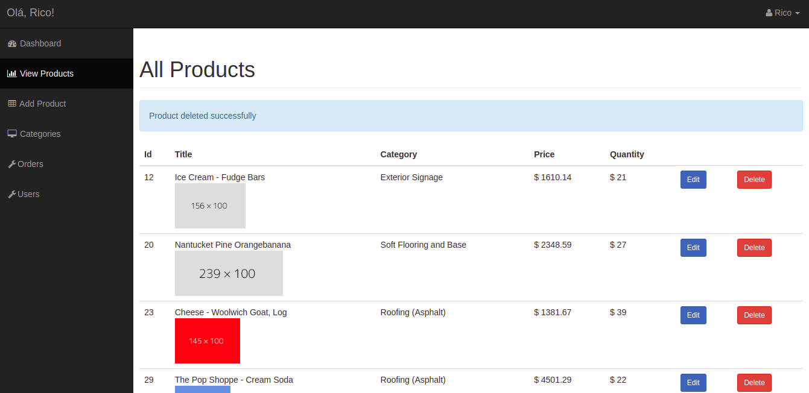
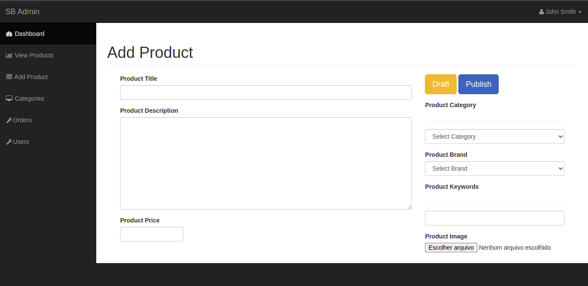
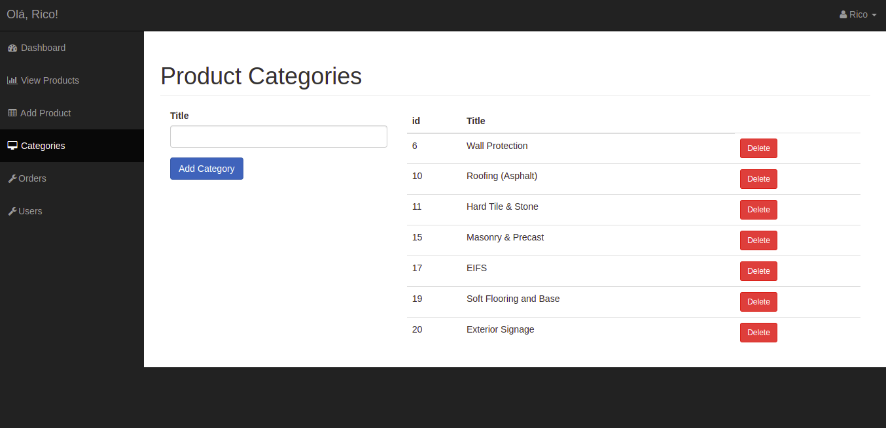
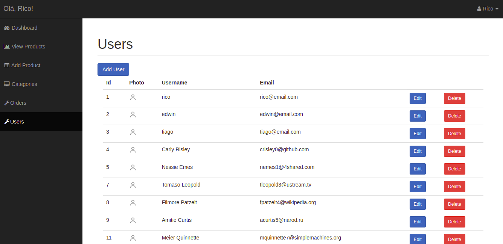
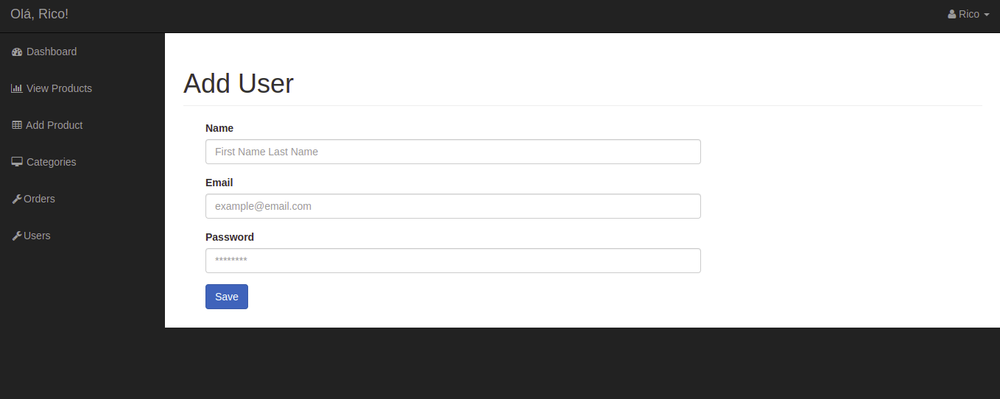

# Ecommerce project using PHP, BootStrap and SQL

Feel free to uset it and make it better

I made id using PHP 7.4 on Ubuntu 18.04

Maybe it needs some changes to work on another OS

database in *ecommerce.sql*

[Udemy Classes](https://www.udemy.com/course/php-for-beginners-how-to-build-an-ecommerce-store/)

